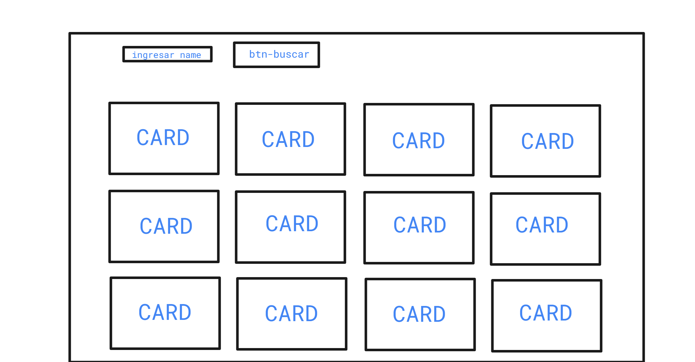
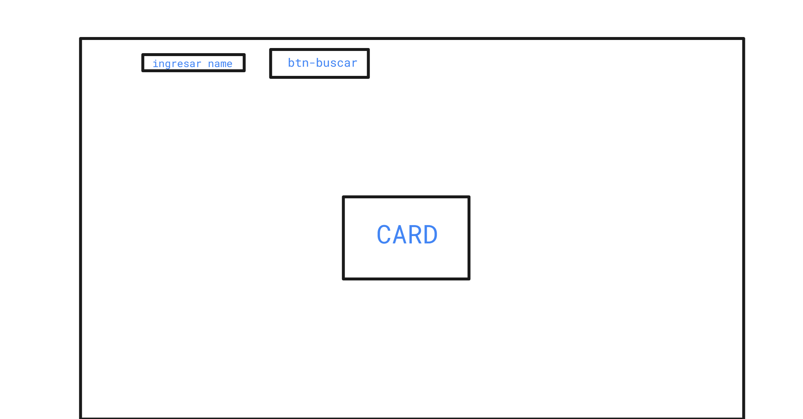
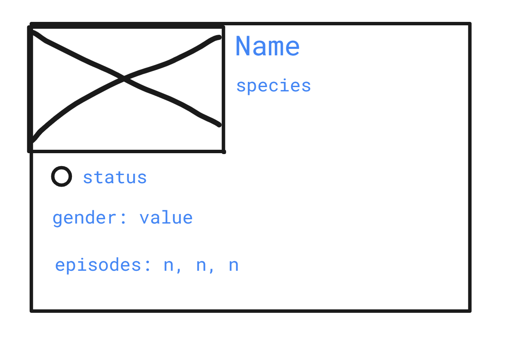
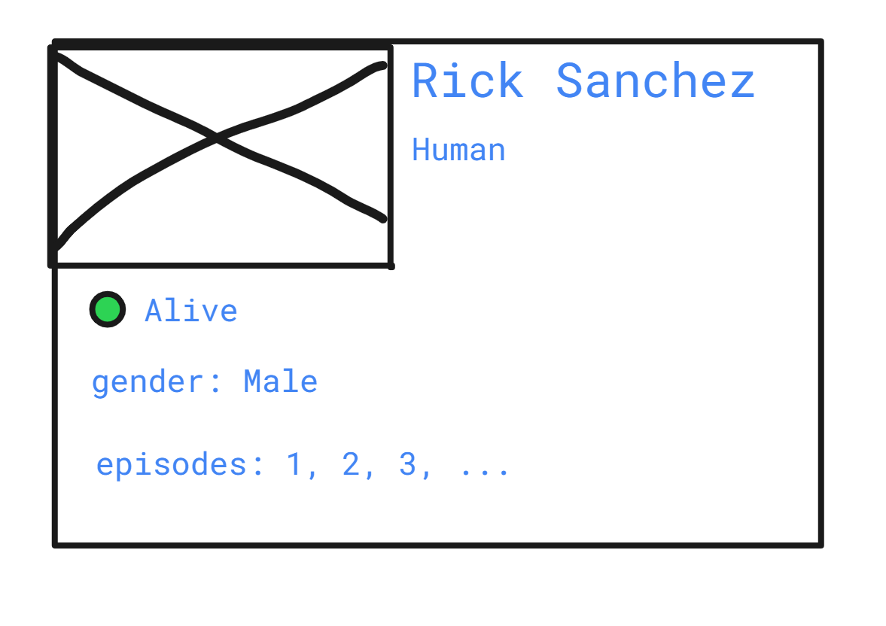

# Ricky and Morty - app

Crear una carpeta llamada *miniProyecto* y ejecutar el siguiente comando:
> npx create-react-app client

En el proyecto se usaran dos rutas
- localhost:3001/
- localhost:3001/:name

La primera para mostrar los primeros 20 personajes de la serie (usar cards para mostrar la info) y la segunda para mostrar un solo personaje, indicandole el nombre por **params**

------------

## diseño de *localhost:3001/*

cáda card tendra la info del personaje.
Al ingresar el nombre de un personaje y al hacer click en el botón, se redirecciona la ruta a /:name

## diseño de *localhost:3001/:name*

------------

## diseño de la card
Se necesitará solo la info necesaria que se indica:

